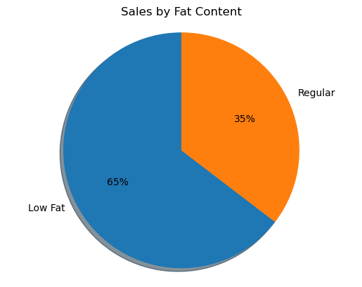
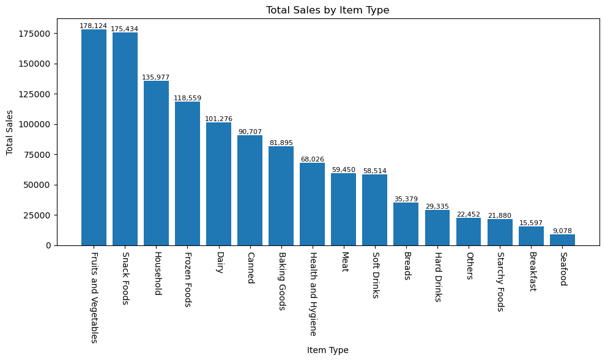
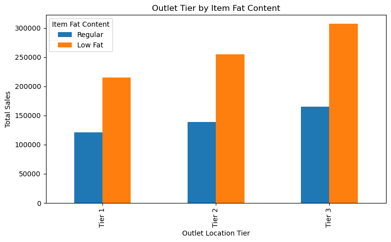
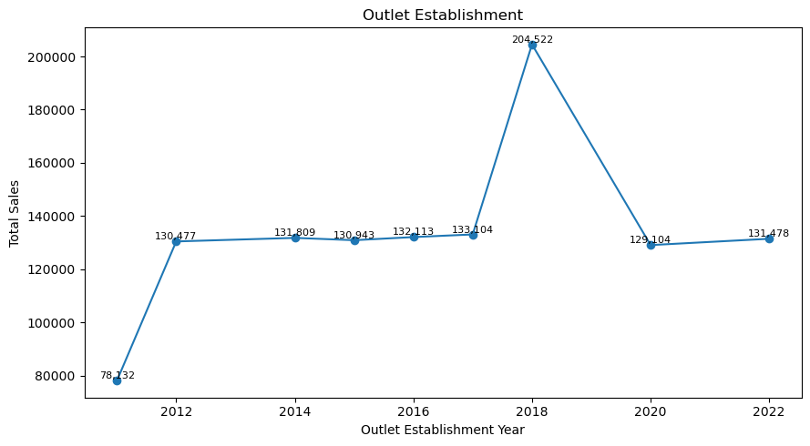
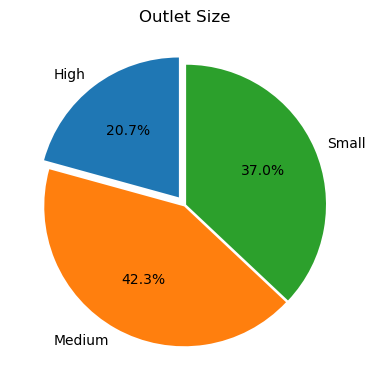
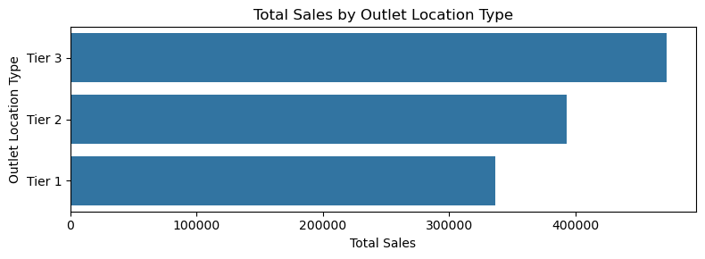

# Blinkit Analysis
## Business Requirement
To conduct a comprehensive analysis of Blinkit's sales performance, customer satisfaction , and inventory distribution to identify key insights and opportunities for optimization using various KPIs and visualizations.

**KPI's Requirement**
1. Total sales: The overall revenue generated from all items sold.
2. Average sales: The average revenue per sale.
3. Number of Items: The total count of different items sold.
4. Average Rating: The average customer rating for items sold.

**Chart's Requirement**
1. Total Sales by Fat Content:
   * Objective: Analyze the impact of fat content of the total sales.
   * Additional KPI Metrics: Assess how other KPIs (average sales, number of items, average rating) vary with fat content.
   * Chart Type: Donut Chart
2. Total Sales by Item Type:
   * Objective: Identify the performance of different items types in terms of total sales.
   * Additional KPI Metrics: Assess how other KPIs (average sales, number of items, average rating) vary with fat content.
   * Chart Type: Bar Chart
3. Fat Content by Outlet for Total Sales:
   * Objective: Compare total sales across different outlets segmentd by fat content.
   * Additional KPI Metrics: Assess how other KPIs (average sales, number of items, average rating) vary with fat content.
   * Chart Type: Stacked Column Chart
4. Total Sales by Outlet Establishment:
   * Objective: Evaluate how the or type of Outlet establishment influences total sales.
   * Chart Type: Line Chart
5. Sale by Outlet Size:
   * Objective: Analyze the correlation between outlet size and total sales.
   * Chart Type: Donut/Pie Chart
6. Sales by Outlet Location:
   * Objective: Assess the geographic distribution of sales across different locations.
   * Chart Type: Funnel Map
   

### Import Libraries


```python
import pandas as pd
import numpy as np
import matplotlib.pyplot as plt
import seaborn as sns
```

### Import Raw Data


```python
df = pd.read_csv(r"C:\Users\ojoar\Desktop\data_set\blinkIT_grocery_data\BlinkIT Grocery Data.csv")
```

### Sample Data


```python
df.head(20)
```


<div>
<style scoped>
    .dataframe tbody tr th:only-of-type {
        vertical-align: middle;
    }

    .dataframe tbody tr th {
        vertical-align: top;
    }

    .dataframe thead th {
        text-align: right;
    }
</style>
<table border="1" class="dataframe">
  <thead>
    <tr style="text-align: right;">
      <th></th>
      <th>Item Fat Content</th>
      <th>Item Identifier</th>
      <th>Item Type</th>
      <th>Outlet Establishment Year</th>
      <th>Outlet Identifier</th>
      <th>Outlet Location Type</th>
      <th>Outlet Size</th>
      <th>Outlet Type</th>
      <th>Item Visibility</th>
      <th>Item Weight</th>
      <th>Sales</th>
      <th>Rating</th>
    </tr>
  </thead>
  <tbody>
    <tr>
      <th>0</th>
      <td>Regular</td>
      <td>FDX32</td>
      <td>Fruits and Vegetables</td>
      <td>2012</td>
      <td>OUT049</td>
      <td>Tier 1</td>
      <td>Medium</td>
      <td>Supermarket Type1</td>
      <td>0.100014</td>
      <td>15.10</td>
      <td>145.4786</td>
      <td>5.0</td>
    </tr>
    <tr>
      <th>1</th>
      <td>Low Fat</td>
      <td>NCB42</td>
      <td>Health and Hygiene</td>
      <td>2022</td>
      <td>OUT018</td>
      <td>Tier 3</td>
      <td>Medium</td>
      <td>Supermarket Type2</td>
      <td>0.008596</td>
      <td>11.80</td>
      <td>115.3492</td>
      <td>5.0</td>
    </tr>
    <tr>
      <th>2</th>
      <td>Regular</td>
      <td>FDR28</td>
      <td>Frozen Foods</td>
      <td>2016</td>
      <td>OUT046</td>
      <td>Tier 1</td>
      <td>Small</td>
      <td>Supermarket Type1</td>
      <td>0.025896</td>
      <td>13.85</td>
      <td>165.0210</td>
      <td>5.0</td>
    </tr>
    <tr>
      <th>3</th>
      <td>Regular</td>
      <td>FDL50</td>
      <td>Canned</td>
      <td>2014</td>
      <td>OUT013</td>
      <td>Tier 3</td>
      <td>High</td>
      <td>Supermarket Type1</td>
      <td>0.042278</td>
      <td>12.15</td>
      <td>126.5046</td>
      <td>5.0</td>
    </tr>
    <tr>
      <th>4</th>
      <td>Low Fat</td>
      <td>DRI25</td>
      <td>Soft Drinks</td>
      <td>2015</td>
      <td>OUT045</td>
      <td>Tier 2</td>
      <td>Small</td>
      <td>Supermarket Type1</td>
      <td>0.033970</td>
      <td>19.60</td>
      <td>55.1614</td>
      <td>5.0</td>
    </tr>
    <tr>
      <th>5</th>
      <td>low fat</td>
      <td>FDS52</td>
      <td>Frozen Foods</td>
      <td>2020</td>
      <td>OUT017</td>
      <td>Tier 2</td>
      <td>Small</td>
      <td>Supermarket Type1</td>
      <td>0.005505</td>
      <td>8.89</td>
      <td>102.4016</td>
      <td>5.0</td>
    </tr>
    <tr>
      <th>6</th>
      <td>Low Fat</td>
      <td>NCU05</td>
      <td>Health and Hygiene</td>
      <td>2011</td>
      <td>OUT010</td>
      <td>Tier 3</td>
      <td>Small</td>
      <td>Grocery Store</td>
      <td>0.098312</td>
      <td>11.80</td>
      <td>81.4618</td>
      <td>5.0</td>
    </tr>
    <tr>
      <th>7</th>
      <td>Low Fat</td>
      <td>NCD30</td>
      <td>Household</td>
      <td>2015</td>
      <td>OUT045</td>
      <td>Tier 2</td>
      <td>Small</td>
      <td>Supermarket Type1</td>
      <td>0.026904</td>
      <td>19.70</td>
      <td>96.0726</td>
      <td>5.0</td>
    </tr>
    <tr>
      <th>8</th>
      <td>Low Fat</td>
      <td>FDW20</td>
      <td>Fruits and Vegetables</td>
      <td>2014</td>
      <td>OUT013</td>
      <td>Tier 3</td>
      <td>High</td>
      <td>Supermarket Type1</td>
      <td>0.024129</td>
      <td>20.75</td>
      <td>124.1730</td>
      <td>5.0</td>
    </tr>
    <tr>
      <th>9</th>
      <td>Low Fat</td>
      <td>FDX25</td>
      <td>Canned</td>
      <td>2018</td>
      <td>OUT027</td>
      <td>Tier 3</td>
      <td>Medium</td>
      <td>Supermarket Type3</td>
      <td>0.101562</td>
      <td>NaN</td>
      <td>181.9292</td>
      <td>5.0</td>
    </tr>
    <tr>
      <th>10</th>
      <td>LF</td>
      <td>FDX21</td>
      <td>Snack Foods</td>
      <td>2018</td>
      <td>OUT027</td>
      <td>Tier 3</td>
      <td>Medium</td>
      <td>Supermarket Type3</td>
      <td>0.084555</td>
      <td>NaN</td>
      <td>109.8912</td>
      <td>5.0</td>
    </tr>
    <tr>
      <th>11</th>
      <td>Low Fat</td>
      <td>NCU41</td>
      <td>Health and Hygiene</td>
      <td>2017</td>
      <td>OUT035</td>
      <td>Tier 2</td>
      <td>Small</td>
      <td>Supermarket Type1</td>
      <td>0.052045</td>
      <td>18.85</td>
      <td>192.1846</td>
      <td>5.0</td>
    </tr>
    <tr>
      <th>12</th>
      <td>Low Fat</td>
      <td>FDL20</td>
      <td>Fruits and Vegetables</td>
      <td>2022</td>
      <td>OUT018</td>
      <td>Tier 3</td>
      <td>Medium</td>
      <td>Supermarket Type2</td>
      <td>0.128938</td>
      <td>17.10</td>
      <td>112.3886</td>
      <td>5.0</td>
    </tr>
    <tr>
      <th>13</th>
      <td>Low Fat</td>
      <td>NCR54</td>
      <td>Household</td>
      <td>2014</td>
      <td>OUT013</td>
      <td>Tier 3</td>
      <td>High</td>
      <td>Supermarket Type1</td>
      <td>0.090487</td>
      <td>16.35</td>
      <td>195.2110</td>
      <td>5.0</td>
    </tr>
    <tr>
      <th>14</th>
      <td>Low Fat</td>
      <td>FDH19</td>
      <td>Meat</td>
      <td>2018</td>
      <td>OUT027</td>
      <td>Tier 3</td>
      <td>Medium</td>
      <td>Supermarket Type3</td>
      <td>0.032928</td>
      <td>NaN</td>
      <td>173.1738</td>
      <td>5.0</td>
    </tr>
    <tr>
      <th>15</th>
      <td>Regular</td>
      <td>FDB57</td>
      <td>Fruits and Vegetables</td>
      <td>2017</td>
      <td>OUT035</td>
      <td>Tier 2</td>
      <td>Small</td>
      <td>Supermarket Type1</td>
      <td>0.018802</td>
      <td>20.25</td>
      <td>222.1772</td>
      <td>5.0</td>
    </tr>
    <tr>
      <th>16</th>
      <td>Low Fat</td>
      <td>FDO23</td>
      <td>Breads</td>
      <td>2022</td>
      <td>OUT018</td>
      <td>Tier 3</td>
      <td>Medium</td>
      <td>Supermarket Type2</td>
      <td>0.147024</td>
      <td>17.85</td>
      <td>93.7436</td>
      <td>5.0</td>
    </tr>
    <tr>
      <th>17</th>
      <td>Low Fat</td>
      <td>NCB07</td>
      <td>Household</td>
      <td>2012</td>
      <td>OUT049</td>
      <td>Tier 1</td>
      <td>Medium</td>
      <td>Supermarket Type1</td>
      <td>0.077628</td>
      <td>19.20</td>
      <td>197.6110</td>
      <td>5.0</td>
    </tr>
    <tr>
      <th>18</th>
      <td>Low Fat</td>
      <td>FDJ56</td>
      <td>Fruits and Vegetables</td>
      <td>2018</td>
      <td>OUT027</td>
      <td>Tier 3</td>
      <td>Medium</td>
      <td>Supermarket Type3</td>
      <td>0.182515</td>
      <td>NaN</td>
      <td>98.7700</td>
      <td>5.0</td>
    </tr>
    <tr>
      <th>19</th>
      <td>Low Fat</td>
      <td>DRN47</td>
      <td>Hard Drinks</td>
      <td>2022</td>
      <td>OUT018</td>
      <td>Tier 3</td>
      <td>Medium</td>
      <td>Supermarket Type2</td>
      <td>0.016895</td>
      <td>12.10</td>
      <td>178.5660</td>
      <td>5.0</td>
    </tr>
  </tbody>
</table>
</div>


### Size of Data


```python
print("Size of Data:   ", df.shape)
```

    Size of Data:    (8523, 12)
    

### Field Information


```python
df.info()
```

    <class 'pandas.core.frame.DataFrame'>
    RangeIndex: 8523 entries, 0 to 8522
    Data columns (total 12 columns):
     #   Column                     Non-Null Count  Dtype  
    ---  ------                     --------------  -----  
     0   Item Fat Content           8523 non-null   object 
     1   Item Identifier            8523 non-null   object 
     2   Item Type                  8523 non-null   object 
     3   Outlet Establishment Year  8523 non-null   int64  
     4   Outlet Identifier          8523 non-null   object 
     5   Outlet Location Type       8523 non-null   object 
     6   Outlet Size                8523 non-null   object 
     7   Outlet Type                8523 non-null   object 
     8   Item Visibility            8523 non-null   float64
     9   Item Weight                7060 non-null   float64
     10  Sales                      8523 non-null   float64
     11  Rating                     8523 non-null   float64
    dtypes: float64(4), int64(1), object(7)
    memory usage: 799.2+ KB
    

### Data Cleaning


```python
df['Item Fat Content'] = df['Item Fat Content'].replace({"LF": "Low Fat", 
                                                         "low fat": "Low Fat", 
                                                         "reg": "Regular"})
```


```python
df['Item Fat Content'].unique()
```


    array(['Regular', 'Low Fat'], dtype=object)


### **Business Requirements**

### **KPI's Requirements**


```python
#Total sales 
total_sales = df["Sales"].sum()

#Average Sales
avg_sales = df["Sales"].mean()

#No. of Items sold
no_of_items_sold = df["Sales"].count()

#Average Rating
avg_rating = df["Rating"].mean()

#Display
print(f"Total Sales: ${total_sales:,.2f}")
print(f"Average Sales: ${avg_sales:,.2f}")
print(f"No. of Items Sold: {no_of_items_sold:,}")
print(f"Average Rating: {avg_rating:.1f}")
```

    Total Sales: $1,201,681.49
    Average Sales: $140.99
    No. of Items Sold: 8,523
    Average Rating: 4.0
    

### **Chart's Requirement**

#### **Total Sales by Fat Content**


```python
sales_by_fat = df.groupby("Item Fat Content")["Sales"].sum()

plt.pie(sales_by_fat, labels=sales_by_fat.index, autopct="%.0f%%", startangle=90, shadow=True)
plt.title("Sales by Fat Content")
plt.axis("equal")

plt.show()
```


    

    


#### **Total Sales by Item Type**


```python
sales_by_type = df.groupby("Item Type")["Sales"].sum().sort_values(ascending = False)

plt.figure(figsize=(10,6))
bars = plt.bar(sales_by_type.index, sales_by_type.values)

plt.xticks(rotation=-90)
plt.xlabel("Item Type")
plt.ylabel("Total Sales")
plt.title("Total Sales by Item Type")

for bar in bars:
    plt.text(bar.get_x() + bar.get_width() / 2, bar.get_height(), 
            f"{bar.get_height():,.0f}", ha='center', va='bottom', fontsize=8)

plt.tight_layout()
plt.show()

```


    

    


#### **Fat Content by Outlet for Total Sales**


```python
grouped = df.groupby(["Outlet Location Type", "Item Fat Content"])["Sales"].sum().unstack()
grouped = grouped[['Regular', 'Low Fat']]

ax = grouped.plot(kind = 'bar', figsize=(8,5), title = "Outlet Tier by Item Fat Content")
plt.xlabel("Outlet Location Tier")
plt.ylabel("Total Sales")
plt.legend(title="Item Fat Content")
plt.tight_layout()

plt.show()
```


    

    


### **Total Sales by Outlet Establishment**


```python
df["Outlet Establishment Year"].unique()
```


    array([2012, 2022, 2016, 2014, 2015, 2020, 2011, 2018, 2017])


```python
sales_by_year = df.groupby("Outlet Establishment Year")["Sales"].sum().sort_index()

plt.figure(figsize=(9,5))
plt.plot(sales_by_year.index, sales_by_year.values, marker='o', linestyle='-')

plt.xlabel("Outlet Establishment Year")
plt.ylabel("Total Sales")
plt.title("Outlet Establishment")

for x, y in zip(sales_by_year.index, sales_by_year.values):
    plt.text(x,y, f"{y:,.0f}", ha='center', va='bottom', fontsize=8)

plt.tight_layout()
plt.show()
```


    

    


### **Sale by Outlet Size**


```python
df["Outlet Size"].unique()
```


    array(['Medium', 'Small', 'High'], dtype=object)


```python
sales_by_size = df.groupby("Outlet Size")["Sales"].sum()

plt.figure(figsize=(4,4))
plt.pie(sales_by_size, labels=sales_by_size.index, autopct='%1.1f%%', startangle=90, explode= (0.07, 0.01, 0.01))
plt.title("Outlet Size")

plt.tight_layout()
plt.show()
```


    

    


### **Sales by Outlet Location**


```python
df.head(2)
```


<div>
<style scoped>
    .dataframe tbody tr th:only-of-type {
        vertical-align: middle;
    }

    .dataframe tbody tr th {
        vertical-align: top;
    }

    .dataframe thead th {
        text-align: right;
    }
</style>
<table border="1" class="dataframe">
  <thead>
    <tr style="text-align: right;">
      <th></th>
      <th>Item Fat Content</th>
      <th>Item Identifier</th>
      <th>Item Type</th>
      <th>Outlet Establishment Year</th>
      <th>Outlet Identifier</th>
      <th>Outlet Location Type</th>
      <th>Outlet Size</th>
      <th>Outlet Type</th>
      <th>Item Visibility</th>
      <th>Item Weight</th>
      <th>Sales</th>
      <th>Rating</th>
    </tr>
  </thead>
  <tbody>
    <tr>
      <th>0</th>
      <td>Regular</td>
      <td>FDX32</td>
      <td>Fruits and Vegetables</td>
      <td>2012</td>
      <td>OUT049</td>
      <td>Tier 1</td>
      <td>Medium</td>
      <td>Supermarket Type1</td>
      <td>0.100014</td>
      <td>15.1</td>
      <td>145.4786</td>
      <td>5.0</td>
    </tr>
    <tr>
      <th>1</th>
      <td>Low Fat</td>
      <td>NCB42</td>
      <td>Health and Hygiene</td>
      <td>2022</td>
      <td>OUT018</td>
      <td>Tier 3</td>
      <td>Medium</td>
      <td>Supermarket Type2</td>
      <td>0.008596</td>
      <td>11.8</td>
      <td>115.3492</td>
      <td>5.0</td>
    </tr>
  </tbody>
</table>
</div>


```python
sales_by_location = df.groupby("Outlet Location Type")["Sales"].sum().reset_index()
sales_by_location = sales_by_location.sort_values("Sales", ascending=False)

plt.figure(figsize=(8, 3))
ax = sns.barplot(x="Sales", y="Outlet Location Type", data = sales_by_location)

plt.title("Total Sales by Outlet Location Type")
plt.xlabel("Total Sales")
plt.ylabel("Outlet Location Type")

plt.tight_layout()
plt.show()
```


    

    

## Reference
This output was based on the youtube tutorial of [Data Tutorials](https://www.youtube.com/watch?v=k4CR3J8-420&t=12s)

